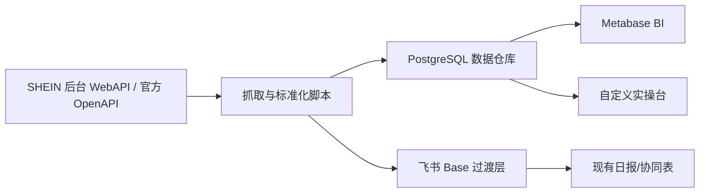

# SHEIN BI 系统架构初版

更新时间：2026-05-11

## 结论

后续方向不是继续堆飞书看板，也不是把本地网页做成越来越复杂的静态页面，而是建设一个可迁移、可扩展的 BI 系统：

## 设计原则

1. **飞书先保留，不再作为新 BI 的源头**
   - 飞书日报继续作为推送渠道；飞书多维表格 / 看板写入当前已临时暂停。
   - 新 BI 不从飞书反抓数据，而是从 SHEIN 抓取后直接入仓。

2. **数据仓库才是真正底座**
   - 原始响应、标准化事实、派生指标、规则建议分层保存。
   - 所有 BI 和网页操作台都从数据仓库读取。

3. **Metabase 做分析，实操台做流程**
   - Metabase 负责筛选、钻取、趋势、店铺/货号/SKC 多维分析。
   - 自定义网页负责“今天该处理什么、复制 SKC、标记已处理、分配同事、备注”。

4. **先本机跑稳，再迁移服务器**
   - 当前本机使用 WSL + Docker + D 盘数据盘。
   - 未来迁移到朋友服务器时，迁移 Docker Compose、数据库、Metabase 即可。

5. **生产链路逐步 API 化，不冒险硬迁移**
   - Windows 计划任务、BI 后置刷新和飞书日报继续运行；飞书 Base / 看板写入是否恢复由暂停开关控制。
   - SHEIN 销售抓取已改为 WebAPI 直连优先，Chrome 登录态保留为 Cookie/session 刷新和失败回退；官方 OpenAPI 继续并行试点，不直接覆盖生产事实表。

## 当前服务

本机已运行：

- `shein-metabase`：Metabase BI 页面；
- `shein-metabase-db`：Metabase 自身配置库；
- `shein-warehouse-db`：SHEIN 数据仓库 PostgreSQL。

已初始化数据仓库 schema：

- 初始化脚本：`scripts/init_bi_warehouse.ps1`
- Schema 文件：`infra/warehouse/schema.sql`
- 入仓脚本：`scripts/load_bi_warehouse.mjs`

存放位置：

- WSL 发行版：`D:\WSL\Ubuntu-24.04`
- Docker 数据盘：`D:\SheinBI\docker-data\docker-data.ext4`
- Compose 配置：`infra/metabase/docker-compose.yml`

访问：

- 当前通过 WSL IP 访问 Metabase，例如 `http://172.22.172.186:3000`
- 当前系统化仪表盘：
  - 经营系统首页：`http://172.22.172.186:3000/dashboard/13`
  - 财务订单域：`http://172.22.172.186:3000/dashboard/14`
  - 退货质量域：`http://172.22.172.186:3000/dashboard/15`
  - 库存履约营销域：`http://172.22.172.186:3000/dashboard/16`
- 早期原型和专题入口仍可用于参考：
  - 经营驾驶舱原型：`http://172.22.172.186:3000/dashboard/5`
  - 店铺视角：`http://172.22.172.186:3000/dashboard/6`
  - 货号视角：`http://172.22.172.186:3000/dashboard/7`
  - 链接/SKC 视角：`http://172.22.172.186:3000/dashboard/8`
- `localhost:3000` 需要管理员权限配置端口转发，暂不强依赖。

## 当前运行态（2026-05-06）

BI 系统当前分为三层入口：

1. **飞书生产链路**
   - 当前只保留飞书日报和异常提醒；Base 表格 / Dashboard 写入由 `state/feishu-base-sync-paused.flag` 暂停。
   - SHEIN 抓数和 BI 刷新不得因飞书 Base 暂停而中断。
   - 销售源文件当前由 WebAPI 直连优先生成；直连失败时才回退 Chrome。

2. **Metabase 分析层**
   - 连接 PostgreSQL 数据仓库。
   - 负责深度筛选、钻取、跨表分析和后续趋势分析。
   - 管理员凭据只保存在 `infra/metabase/.admin.local.json`，不要写入文档或聊天。

3. **本地 BI 经营门户**
   - 文件入口：`outputs/bi-portal/index.html`
   - 本机服务：`http://127.0.0.1:8787/`
   - 负责“每天先看什么、先处理什么、如何复制指令、如何标记处理状态”。
   - 当前服务支持本机 `127.0.0.1:8787` 和临时局域网入口 `http://DUSHENGYI-PC2:8787/` / `http://<当前WLAN-IP>:8787/`；局域网只限私有网段试用，未开放公网。电脑重启后 DHCP 可能换 IP，团队访问不要依赖旧固定 IP。
   - 通过本机服务打开时，动作状态写入 `state/bi_action_state.json`；直接双击 HTML 打开时，动作状态保存在浏览器本地。
   - 系统状态页已接入 `mart.openapi_sales_reconciliation`，展示 HL 官方 OpenAPI 销售试点与当前生产销售源的对账状态；该试点暂不覆盖正式销售事实表。

当前团队访问状态：

- 已具备：本机门户、局域网临时访问、服务端动作状态文件、深链接、动作清单复制、CSV 导出、系统巡检页。
- 未完成：正式账号/权限、固定服务器地址、多人编辑冲突控制、动作状态入库、HTTPS、备份和权限分级。

当前自动任务状态：

- 任务名：`SHEIN-BI-Daily-Pipeline-0700`
- 时间：每天 `07:00`
- 入口：`wscript.exe` + `scripts/run_scheduled_hidden.vbs` + `scripts/scheduled_bi_daily_pipeline.ps1`
- `2026-05-09 07:00:01` 正式自动任务已运行成功；后续 `2026-05-09 14:10` 销售滚动后置 BI 也已成功刷新。
- `2026-05-02 07:00` 的 `267014` 是已修复的历史失败记录，保留作排障证据。
- 链接表现每日任务为 `SHEIN-Sales-15Stores-LinkManagement-0530`，每天 `05:30`，用于抓前一完整业务日链接数据和业务域数据，先写本地文件；`07:00` BI 流水线再入仓刷新门户，不再写飞书链接表。
- ET 货代仓每日任务为 `SHEIN-Sales-ETForwarder-0420`，每天 `04:20`，用于抓 ET 库存、RTV、出库、发货申请单、库存流水和财务；`07:00` BI 流水线会结合 SHEIN 售后做 RTV 换单复核和仓库去向追踪。

## 数据分层

### 1. 原始层 `raw`

保存从 SHEIN 接口拿到的原始响应摘要和完整 JSON 文件索引：

- 抓取时间；
- 店铺；
- 页面/接口；
- 日期范围；
- 原始文件路径；
- 响应状态和错误。

用途：排错、字段追溯、未来补字段。

### 2. 明细事实层 `fact`

按业务实体拆成稳定事实表：

- `fact_order`
- `fact_order_item`
- `fact_product_daily_sales`
- `fact_link_master_snapshot`
- `fact_link_performance_daily`
- `fact_display_inventory_daily`
- `fact_after_sales`
- `fact_fulfillment_daily`
- `fact_marketing_campaign_daily`
   - OpenAPI 并行试点表：`fact.openapi_store_daily_sales`、`fact.openapi_order_header`、`fact.openapi_order_item`。这些表只用于官方 OpenAPI / 当前生产销售源双跑验证，正式切换前不作为首页和日报的生产销售源。

用途：Metabase 的主要数据源。

### 3. 维度层 `dim`

保存相对稳定的解释字段：

- `dim_store`
- `dim_product`
- `dim_skc`
- `dim_link`
- `dim_category`
- `dim_site`
- `dim_activity`

用途：跨主题关联和筛选。

### 4. 派生指标层 `mart`

按使用场景做聚合宽表：

- `mart_store_daily`
- `mart_product_store_coverage`
- `mart_link_action_candidates`
- `mart_link_health_score`
- `mart_product_opportunity`
- `mart_inventory_risk`
- `mart.openapi_sales_reconciliation`：官方 OpenAPI 试点与当前生产销售源的日维度对账表，记录销售额、订单数、商品行数、源文件和 `matched` / `warning` 状态。

用途：BI 看板、日常筛选、实操台。

### 5. 规则建议层 `ops`

保存系统建议和人工处理状态：

- `ops_action`
- `ops_action_history`
- `ops_assignment`
- `ops_note`

用途：后续团队协作。

## 当前入仓状态（2026-05-06 截面）

当前 BI 仓库已经按 16 店写入 `2026-05-06` 销售截面，业务域和链接表现为前一完整业务日 `2026-05-05`：

- 销售日期：`2026-05-06`
- 业务日期：`2026-05-05`
- 链接日期：`2026-05-05`
- 当前侧栏源抓取时间：销售 `2026-05-06T10:10:13.337+08:00`；业务域 `2026-05-06 05:46:42`；链接 `2026-05-06 05:37:48`。
- 店铺覆盖：`CX DL DX FY HL JY LQ MZ NM QH QY TS TZ XL YJ ZL`
- 已覆盖业务域：销售订单、订单商品、链接主数据、链接表现、货号店铺覆盖、链接建议、售后/退货、发货面单、正确展示库存、商品质量、商品评价、营销活动、首页财务摘要、gsfs 财务收入概览、gsfs 在途收入订单。

当前已知限制：

- gsfs 财务收入概览仍受接口/验证限制，完整财务结算流水需要后续继续补。
- 趋势、排行、利润和评价已按当前仓库数据驱动；仍不得用假环比或假趋势填充缺失数据。
- `2026-05-05` Docker / WSL 文件系统异常已手动恢复；`2026-05-06` 正式自动任务已跑通，系统状态页不应再把该历史恢复态标成待验证。

重要实现细节：

- 入仓脚本按 `日期 + 店铺` 删除旧切片后重写，避免同一天同店重跑后旧明细残留。
- 2026-05-10 已用稳定日期重抓对账验证 16 店 profile 与登录抓数未错位；profile 错位排查以接口数据和数据库样本为准，不以页面散落文本为准。
- 门户系统状态页会同时显示正式自动任务日志和最新手动验证日志，避免把手动成功误认为自动成功。

## 第一批 BI 页面建议

### 经营首页

当前已落地第一版原型，包含：

- 今日销售额；
- 今日订单数；
- 今日重点动作数；
- 潜在下架候选数；
- 店铺经营矩阵；
- 货号销售与链接覆盖；
- 今日链接实操池；
- 潜在下架候选明细；
- 链接状态分布；
- 商品分析漏斗 Top。

这一版的目标不是最终 UI，而是验证 Metabase 能否围绕店铺、货号、SKC/链接和实操动作进行多维钻取。

为降低 Metabase 卡片 SQL 复杂度，当前已在数据仓库补充 5 个 BI 友好视图：

- `mart.bi_store_overview_current`：店铺经营总览；
- `mart.bi_store_product_matrix_current`：店铺 × 货号覆盖与销售矩阵；
- `mart.bi_product_overview_current`：货号总览；
- `mart.bi_link_health_current`：链接/SKC 健康分层；
- `mart.bi_action_queue_current`：当前实操队列。

- 今日/昨日/本月销售额；
- 店铺排行；
- 货号排行；
- 销售趋势；
- 异常提醒：销售下滑、缺链接、待上架卡点、库存风险。

### 店铺视角

- 一个店铺的销售趋势；
- 店铺内热销/滞销货号；
- 店铺内缺链接货号；
- 店铺内待优化链接；
- 店铺内库存/履约/售后异常。

### 货号视角

- 一个标准货号在 16 店的上架覆盖；
- 各店销量；
- 各店链接状态；
- 同货号多链接优胜劣汰；
- 是否有店铺缺链接但其他店表现好。

### SKC / 链接视角

- 某条链接的曝光、点击、商详、加车、支付、销量趋势；
- 标签、活动、质量、评论、退货；
- 库存展示数和库龄；
- 优化/下架建议原因。

### 操作台

- 今日重点处理；
- 补链接；
- 待上架卡点；
- 优化候选；
- 下架候选；
- 库存调整；
- 复核项。

## 库存口径

库存不再从 `备货信息` 判断。

当前 BI 使用商品列表库存接口作为正确展示库存来源：

- `/spmp-api-prefix/spmp/product/query_msc_stock_for_released_page`

调用时必须传完整 SKC/SKU 结构：

- `spu_skc_list[].spu_name`
- `spu_skc_list[].skc_name_list[].skc_name`
- `spu_skc_list[].skc_name_list[].sku_code_list`

如果少传 `sku_code_list`，接口可能返回错误的 `0` 库存。

`库存 / 库龄列表` 仍作为后续可研究入口保留：

- 路由：`#/gsp/inventory-management/storage-age`
- 接口：`/gsp/storage/stockAge/list`

但第一阶段库存预警已经不依赖库龄列表。当前“库存动作”只保留：

- 低库存行本身处于 `ON_SHELF`；
- 最近 30 天有链接销量或订单销量；
- 全部待上架、全部售罄、全部下架、无销售迹象的低库存行不进入今日动作池。

## 迁移路线

### 阶段 1：本机 BI 基座

- Metabase 跑起来；
- PostgreSQL 数据仓库跑起来；
- SHEIN 后台数据地图完成；
- 现有销售/链接数据双写入仓。

### 阶段 2：Metabase 原型

- 经营首页；
- 店铺视角；
- 货号视角；
- SKC/链接视角；
- 规则建议视角。

### 阶段 3：自定义实操台

- 读取 `ops_action`；
- 支持复制 SKC、备注、标记处理、分配同事；
- 处理状态回写数据库，必要时同步飞书。

### 阶段 4：团队访问

- 先局域网；
- 再服务器；
- 最后考虑账号权限、HTTPS、备份、外网访问。

## 与飞书的关系

短期：

- 每天按时抓取、刷新 BI、发飞书日报；
- 飞书多维表格 / 看板写入暂停保留查档；
- 新 BI 系统做旁路验证。

中期：

- 飞书 Base 只保留协作和人工确认用表；
- 复杂 BI 全部迁到 Metabase。

长期：

- 如果 BI + 操作台稳定，飞书看板可以逐步下线；
- 飞书日报可保留为推送渠道，而不是数据底座。

