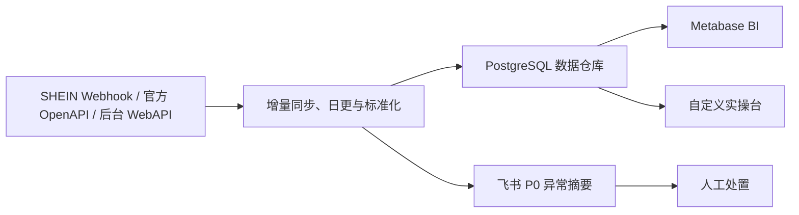

# SHEIN BI 系统架构

更新时间：2026-07-26

## 结论

后续方向不是继续堆飞书看板，也不是把本地网页做成越来越复杂的静态页面，而是建设一个可迁移、可扩展的 BI 系统：

## 设计原则

1. **飞书先保留，不再作为新 BI 的源头**
   - 飞书日报脚本只保留手动推送入口，自动发送当前停用；飞书多维表格 / 看板写入当前已临时暂停。
   - 新 BI 不从飞书反抓数据，而是从 SHEIN 抓取后直接入仓。

2. **数据仓库才是真正底座**
   - 原始响应、标准化事实、派生指标、规则建议分层保存。
   - 所有 BI 和网页操作台都从数据仓库读取。

3. **Metabase 做分析，实操台做流程**
   - Metabase 负责筛选、钻取、趋势、店铺/货号/SKC 多维分析，当前仍是正式深度分析层，不能在没有替代前删除。
   - 自定义网页负责“今天该处理什么、复制 SKC、标记已处理、分配同事、备注”。

4. **云端为正式入口，本地只作回滚**
   - 自 `2026-05-15` 起，云端 BI 是正式入口，本地 `8787` 服务和 `SHEIN-*` Windows 任务已封存。
   - 本机 WSL + Docker + D 盘数据盘只保留为开发、排障和短期回滚参考。

5. **生产链路逐步 API 化，不冒险硬迁移**
   - 云端 systemd 已覆盖 Webhook/OpenAPI 当天销售、最终日核对与晋升、BI Portal、数据库备份、ET、飞书日报手动入口、统一慢变日更、异常通知和登录态巡检；网页/CLI 问数继续可用，飞书日报自动发送与飞书只读问数 service 均停用。
   - 2026-07-23 起半托当天销售由 Webhook 触发按单 OpenAPI 写正式事实；前一天 WebAPI 只作独立核对，19/19 店深度匹配后才原子晋升 OpenAPI 日切片。商品流量、四档状态、营销与编辑级资料仍按各自 OpenAPI/WebAPI/headless 边界逐项演进。
   - 2026-07-26 起半托生产 OpenAPI 数据面为 DL 单一 App + 19 店唯一 OpenKey；原独立 App 只作回滚，不进入生产业务处理。

## 当前服务

云端正式运行：

- `shein-metabase`：Metabase BI 页面；
- `shein-metabase-db`：Metabase 自身配置库；
- `shein-warehouse-db`：SHEIN 数据仓库 PostgreSQL。

已初始化数据仓库 schema：

- 初始化脚本：`scripts/init_bi_warehouse.ps1`
- Schema 文件：`infra/warehouse/schema.sql`
- 入仓脚本：`scripts/load_bi_warehouse.mjs`

云端存放位置：

- 代码目录：`/opt/shein-bi/app`
- 数据库备份目录：`/srv/shein-bi/backups/auto`
- Compose 配置：`infra/metabase/docker-compose.yml`

访问：

- 云端 BI Portal：`https://sa.dushengyi.cc/`，旧 IP `http://43.165.167.135/` 仅作兜底，BI 应用内登录保护。
- Metabase 运行在云端 Docker 内部，不在文档中写公网裸地址；本地旧 WSL 地址只作历史排障参考。
- Metabase dashboard 编号仍可作为内部迁移参考，但不要使用旧本地 WSL IP 作为正式入口。

## 当前运行态（2026-07-26）

BI 系统当前分为三层入口：

1. **飞书生产链路**
   - Base 表格 / Dashboard 写入由 `state/feishu-base-sync-paused.flag` 暂停。
   - 飞书日报脚本、异常通知 watchdog 和只读问数机器人已云端化并验证；日报自动发送当前停用，本地历史监听/提醒任务只作回滚参考。
   - SHEIN 抓数和 BI 刷新不得因飞书 Base 暂停而中断。
   - 当天销售事实由 Webhook/OpenAPI 增量更新；WebAPI 文件用于最终日独立核对和其它尚未 API 化的数据域，不因 Base 暂停而中断。

2. **Metabase 分析层**
   - 连接 PostgreSQL 数据仓库。
   - 负责深度筛选、钻取、跨表分析和后续趋势分析；当前云端必须一起部署，除非后续自研门户已经完整替代这些能力。
   - 管理员凭据只保存在 `infra/metabase/.admin.local.json`，不要写入文档或聊天。

3. **云端 BI 经营门户**
   - 文件入口：`outputs/bi-portal/index.html`
   - 云端入口：`https://sa.dushengyi.cc/`，旧 IP `http://43.165.167.135/` 仅作兜底
   - 负责“每天先看什么、先处理什么、如何复制指令、如何标记处理状态”。
   - API section cache 位于 `outputs/bi-portal/sections/`；派生 section 要遵守源缓存生命周期，例如 `homeProfit` 必须从当前 `profit` section 派生。`serve_bi_portal.mjs` 负责 section API、gzip/raw cache 返回，以及 core `generatedAt` 变化后的后台 warmup 兜底。
   - 首页"单货号成交价格分布"面板：依赖销售明细/homeRankings 行，客户端计算每行均价并分桶，无新写路径，只读决策支持。
   - 首页"成交价散点图"（priceScatter section）：基于 `fact.order_item` 的 `unit_price_sar = sales_sar / quantity`，按订单日期 × 成交单价绘制散点；不筛选货号时显示全货盘分布，筛选后缩小到单货号。Section API 为 `/api/bi/section/priceScatter`，需同时在 `BI_PORTAL_SECTION_KEYS` 白名单注册。
   - 本地 `127.0.0.1:8787` 和局域网入口已封存，不再作为正式入口。
   - 自动运营会话、任务、job、事件和审计已进入 PostgreSQL `ops.link_ops_*`，revision、idempotency 和租约共同防并发覆盖。
   - `fact.openapi_*` 与 `mart.openapi_sales_reconciliation` 是 OpenAPI 可追溯来源和最终日门禁证据；切换日以后当天事实由 Webhook 定向写入，最终日仍需全店匹配后原子晋升。

当前团队访问状态：

- 已具备：云端域名/HTTPS、应用内登录、账号/店铺权限、PostgreSQL 任务状态、可恢复 job、深链接、CSV 导出、系统巡检和审计。
- 持续维护：异地备份恢复演练、数据域逐项 API 化和前端可读性；不能把这些长期维护项写成生产入口尚未完成。

当前自动任务状态：

- 生产调度以 `infra/systemd/*.timer` 和 [cloud-bi-operations.md](cloud-bi-operations.md) 为事实源；半托当天销售由 Webhook 事件触发，不再存在每小时 `today` timer。
- 云端 `shein-bi-cloud-morning-chain.timer`：每天 `08:00`，跳过重复的当天销售抓取，直接启动 `shein-bi-cloud-daily-refresh.service` 做前一完整日统一补采；当前飞书日报自动发送已停用。
- 云端 `shein-bi-cloud-yesterday.timer`：每天 `03:00`，生成前一天 WebAPI 核对文件、复核稳定日，并在 19/19 OpenAPI 深度匹配后原子晋升最终日切片。
- 云端 `shein-bi-db-backup.timer`：每天 `02:40`，备份业务库和 Metabase 元数据库。
- 云端 `shein-bi-cloud-session-manager.timer`、`shein-bi-cloud-et-forwarder.timer`、`shein-bi-cloud-browser-cleanup.timer` 和 `shein-bi-cloud-watchdog.timer` 分别承担登录态巡检、ET 出库/货代、非业务窗口残留浏览器清理和异常通知。飞书问数服务保持暂停；旧 `today/daily-lark-report/link-business/rtv-verify/openapi-hl` 分散 timer 不再是生产调度。
- 本地 `SHEIN-BI-Daily-Pipeline-0700`、`SHEIN-Sales-15Stores-LinkManagement-0530`、`SHEIN-Sales-ETForwarder-0420` 等 Windows 任务已封存禁用，仅保留为回滚/迁移参考。

## 数据分层

### 1. 原始层 `raw`

保存从 SHEIN 接口拿到的原始响应摘要和完整 JSON 文件索引：

- 抓取时间；
- 店铺；
- 页面/接口；
- 日期范围；
- 原始文件路径；
- 响应状态和错误。

用途：排错、字段追溯、未来补字段。

### 2. 明细事实层 `fact`

按业务实体拆成稳定事实表：

- `fact_order`
- `fact_order_item`
- `fact_product_daily_sales`
- `fact_link_master_snapshot`
- `fact_link_performance_daily`
- `fact_display_inventory_daily`
- `fact_after_sales`
- `fact_fulfillment_daily`
- `fact_marketing_campaign_daily`
   - OpenAPI 来源表：`fact.openapi_store_daily_sales`、`fact.openapi_order_header`、`fact.openapi_order_item`。切换日以后它们承接 Webhook 定向同步和最终日全量来源，同时继续作为 reconciliation 与回滚证据；正式事实仍通过受限 apply/promote 函数写入，不允许业务脚本任意双写。

用途：Metabase 的主要数据源。

### 3. 维度层 `dim`

保存相对稳定的解释字段：

- `dim_store`
- `dim_product`
- `dim_skc`
- `dim_link`
- `dim_category`
- `dim_site`
- `dim_activity`

用途：跨主题关联和筛选。

### 4. 派生指标层 `mart`

按使用场景做聚合宽表：

- `mart_store_daily`
- `mart_product_store_coverage`
- `mart_link_action_candidates`
- `mart_link_health_score`
- `mart_product_opportunity`
- `mart_inventory_risk`
- `mart.openapi_sales_reconciliation`：官方 OpenAPI 试点与当前生产销售源的日维度对账表，记录销售额、订单数、商品行数、源文件和 `matched` / `warning` 状态。

用途：BI 看板、日常筛选、实操台。

### 5. 规则建议层 `ops`

保存系统建议和人工处理状态：

- `ops_action`
- `ops_action_history`
- `ops_assignment`
- `ops_note`

用途：后续团队协作。

- 下架候选实现组件：策略库 `lib/link_retire_candidate_policy.mjs`、CSV 报告 `scripts/build_link_retire_candidates_from_csv.mjs`、云端执行器 `scripts/execute_retire_candidates_openapi.mjs`、货号修复 `scripts/repair_retire_supplier_code_openapi.mjs` + `lib/retire_supplier_code_repair_payload.mjs`。下架和货号修复是独立阶段，货号修复失败不阻断下架。

## 当前入仓状态（2026-05-06 截面）

当前 BI 仓库已经按 16 店写入 `2026-05-06` 销售截面，业务域和链接表现为前一完整业务日 `2026-05-05`：

- 销售日期：`2026-05-06`
- 业务日期：`2026-05-05`
- 链接日期：`2026-05-05`
- 当前侧栏源抓取时间：销售 `2026-05-06T10:10:13.337+08:00`；业务域 `2026-05-06 05:46:42`；链接 `2026-05-06 05:37:48`。
- 店铺覆盖：`CX DL DX FY HL JY LQ MZ NM QH QY TS TZ XL YJ ZL`
- 已覆盖业务域：销售订单、订单商品、链接主数据、链接表现、货号店铺覆盖、链接建议、售后/退货、发货面单、正确展示库存、商品质量、商品评价、营销活动、首页财务摘要、gsfs 财务收入概览、gsfs 在途收入订单。

当前已知限制：

- gsfs 财务收入概览仍受接口/验证限制，完整财务结算流水需要后续继续补。
- 趋势、排行、利润和评价已按当前仓库数据驱动；仍不得用假环比或假趋势填充缺失数据。
- `2026-05-05` Docker / WSL 文件系统异常已手动恢复；`2026-05-06` 正式自动任务已跑通，系统状态页不应再把该历史恢复态标成待验证。

重要实现细节：

- 入仓脚本按 `日期 + 店铺` 删除旧切片后重写，避免同一天同店重跑后旧明细残留。
- 2026-05-10 已用稳定日期重抓对账验证 16 店 profile 与登录抓数未错位；profile 错位排查以接口数据和数据库样本为准，不以页面散落文本为准。
- 门户系统状态页会同时显示正式自动任务日志和最新手动验证日志，避免把手动成功误认为自动成功。

## 第一批 BI 页面建议

### 经营首页

当前已落地第一版原型，包含：

- 今日销售额；
- 今日订单数；
- 今日重点动作数；
- 潜在下架候选数；
- 店铺经营矩阵；
- 货号销售与链接覆盖；
- 今日链接实操池；
- 潜在下架候选明细；
- 链接状态分布；
- 商品分析漏斗 Top。

这一版的目标不是最终 UI，而是验证 Metabase 能否围绕店铺、货号、SKC/链接和实操动作进行多维钻取。

为降低 Metabase 卡片 SQL 复杂度，当前已在数据仓库补充 5 个 BI 友好视图：

- `mart.bi_store_overview_current`：店铺经营总览；
- `mart.bi_store_product_matrix_current`：店铺 × 货号覆盖与销售矩阵；
- `mart.bi_product_overview_current`：货号总览；
- `mart.bi_link_health_current`：链接/SKC 健康分层；
- `mart.bi_action_queue_current`：当前实操队列。

**SQL schema drift 注意**：`generate_bi_portal.mjs` 的 insights CTE 曾误用 `FROM mart.bi_link_health_current`（该视图暴露 `eps_uv` 而非 `c7_eps_uv`），导致云端刷新失败。修复后改为 `FROM link_health_enriched`（同链 CTE 别名）。后续新增引用 `mart.*` 视图时，必须先用 `\dv mart.*` 和 `\d mart.<view>` 确认字段名，不能假设 CTE 别名与视图字段同名。

- 今日/昨日/本月销售额；
- 店铺排行；
- 货号排行；
- 销售趋势；
- 异常提醒：销售下滑、缺链接、待上架卡点、库存风险。

### 店铺视角

- 一个店铺的销售趋势；
- 店铺内热销/滞销货号；
- 店铺内缺链接货号；
- 店铺内待优化链接；
- 店铺内库存/履约/售后异常。

### 货号视角

- 一个标准货号在当前启用店铺的上架覆盖；
- 各店销量；
- 各店链接状态；
- 同货号多链接优胜劣汰；
- 是否有店铺缺链接但其他店表现好。

### SKC / 链接视角

- 某条链接的曝光、点击、商详、加车、支付、销量趋势；
- 标签、活动、质量、评论、退货；
- 库存展示数和库龄；
- 优化/下架建议原因。

### 操作台

- 今日重点处理；
- 补链接；
- 待上架卡点；
- 优化候选；
- 下架候选：必须先生成明细给用户确认，不自动执行；统一安全口径为已上架、近 7 天曝光 `c7EpsUv <= 300`、近 7 天销量 `c7_sale_cnt = 0`、SHEIN 新品标签 `newGoodsTag` 为空、首次上架已满 15 天。缺首次上架时间或缺新品标签字段的旧数据只能放待确认/不执行；
- 下架后货号修复是独立流程，只调 `partialEdit` 改货号为`（废）标准货号`，不调 shelf 接口；修复失败不阻断已完成的下架。
- 库存调整；
- 复核项。

## 库存口径

库存不再从 `备货信息` 判断。

当前 BI 使用商品列表库存接口作为正确展示库存来源：

- `/spmp-api-prefix/spmp/product/query_msc_stock_for_released_page`

调用时必须传完整 SKC/SKU 结构：

- `spu_skc_list[].spu_name`
- `spu_skc_list[].skc_name_list[].skc_name`
- `spu_skc_list[].skc_name_list[].sku_code_list`

如果少传 `sku_code_list`，接口可能返回错误的 `0` 库存。

`库存 / 库龄列表` 仍作为后续可研究入口保留：

- 路由：`#/gsp/inventory-management/storage-age`
- 接口：`/gsp/storage/stockAge/list`

但第一阶段库存预警已经不依赖库龄列表。当前“库存动作”只保留：

- 低库存行本身处于 `ON_SHELF`；
- 最近 30 天有链接销量或订单销量；
- 全部待上架、全部售罄、全部下架、无销售迹象的低库存行不进入今日动作池。

## 迁移路线

### 阶段 1：本机 BI 基座（已完成，现为回滚参考）

- Metabase 跑起来；
- PostgreSQL 数据仓库跑起来；
- SHEIN 后台数据地图完成；
- 现有销售/链接数据双写入仓。

### 阶段 2：Metabase 原型

- 经营首页；
- 店铺视角；
- 货号视角；
- SKC/链接视角；
- 规则建议视角。

### 阶段 3：自定义实操台

- 读取 `ops_action`；
- 支持复制 SKC、备注、标记处理、分配同事；
- 处理状态回写数据库，必要时同步飞书。

### 阶段 4：团队访问（云端进行中）

- 云端临时公网入口 + BI 应用内登录已启用；
- 本地局域网入口已封存；
- 下一步补域名、HTTPS、异地备份、动作状态入库和权限分级。

## 与飞书的关系

短期：

- 每天按时抓取、刷新 BI；飞书日报仅保留手动临时发送入口；
- 飞书多维表格 / 看板写入暂停保留查档；
- 新 BI 系统做旁路验证。

中期：

- 飞书 Base 只保留协作和人工确认用表；
- 复杂 BI 继续由 Metabase 承接，同时把高频经营动作沉淀到 BI Portal；在自研门户完全覆盖自由钻取前，不下线 Metabase。

长期：

- 如果 BI + 操作台稳定，飞书看板可以逐步下线；
- 飞书日报可作为手动推送渠道保留，而不是数据底座；若要恢复自动发送，需重新确认内容设计和 timer。
