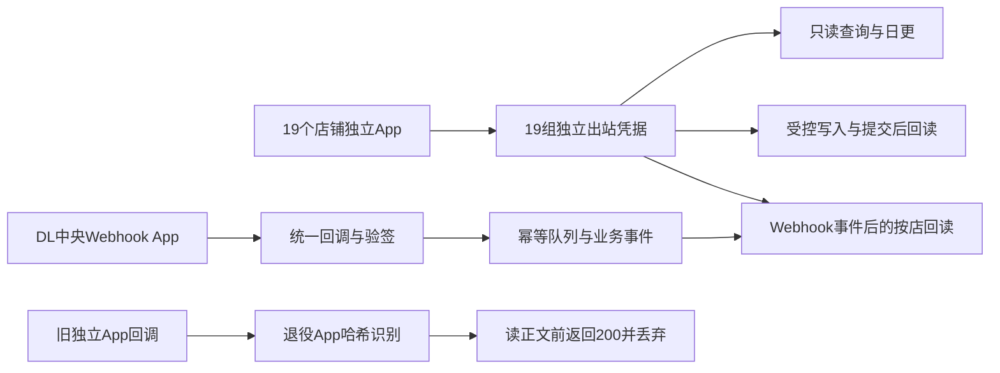

# 半托 OpenAPI 19店独立应用切回（2026-07-30）

## 结论

2026-07-30 已把半托生产的**出站 OpenAPI 请求**从“DL 单一 App 共享19店额度”切回“19店各自独立 App”：

- 通用只读、受控写、BI/CLI、日更、营销库存兜底和 Webhook 后续回读，均使用目标店铺自己的 OpenKey/Secret 和独立 App 配额。
- 商品列表、库存和 `spu-info` 恢复每日全量读取；`cloud_openapi_product_reconciliation.sh` 默认 `maxDetails=0`，不再每店轮转16条。
- Webhook 入站验签仍由 DL 中央 App 统一接收。该链路只接收事件，不承担全店批量商品抓取，因此不占用本次需要隔离的商品详情调用预算。
- Webhook 验签配置与出站 OpenAPI 配置已拆分。旧独立 App 的重复回调仍在读取正文、解密和落库之前返回200并丢弃，避免双事件和双写。

## 当前拓扑

## 私有配置边界

| 用途 | 云端文件 | 说明 |
|---|---|---|
| 出站 OpenAPI | `/opt/shein-bi/app/config/shein_openapi.local.json` | 19店独立凭据；生产读取和受控写的唯一配置 |
| Webhook 入站验签 | `/srv/shein-bi/secrets/webhook-openapi-central.json` | DL中央App、19个中央授权OpenKey及18个退役App哈希 |
| 原19店配置归档 | `/srv/shein-bi/secrets/openapi-legacy/shein_openapi.pre-consolidation-20260726-135510.json` | 本次切回来源；只读保留 |
| 切回前快照 | `/srv/shein-bi/backups/openapi-per-store-cutback-20260730-153639` | 中央配置和Webhook unit回滚点 |

以上文件权限均保持私有，不进入GitHub，不在日志或发布说明中输出密钥。

## 分批切换

实际按三店一组完成：

1. CX、DL、DX
2. FY、HL、JSH
3. JY、LQ、MZ
4. NM、QH、QY
5. TS、TZ、TZZ
6. XC、XL、YJ
7. ZL

每批都在配置原子替换后执行真实只读探测，最终19店均通过。

## 验收

- 旧独立配置预探测：`19/19` 成功。
- 分批切换探测：每批全部成功。
- 最终全店探测：`19/19 read_probe_ok`，`pending=0`，`failed=0`。
- 最终出站配置：19店、19组凭据、19个独立App，全部与切回来源指纹一致。
- Webhook：`active`，验签配置仍为1个中央App、19店、18个退役App；业务回读使用独立出站配置。
- 全量商品对账：`19/19 matched`，`2,466`条商品列表、`2,464/2,464`条详情、`2,470/2,470`条库存读取成功。
- 商品对账硬缺口：详情缺失0、库存缺失0、无Webhook证据的状态回退0、warning 0。
- 完整确定性测试：`134/134`通过。

## 回滚

如果独立App出现平台级异常：

1. 暂停新的日更和受控写任务。
2. 从 `/srv/shein-bi/backups/openapi-per-store-cutback-20260730-153639/openapi-central-before.json` 原子恢复出站配置。
3. 保持 `/srv/shein-bi/secrets/webhook-openapi-central.json` 不变。
4. 重启 Portal 与 Webhook，使后续回读重新加载配置。
5. 执行19店只读探测、商品对账、Webhook health和watchdog。

回滚不得删除数据库事实、Webhook receipt、旧独立授权或中央授权。
