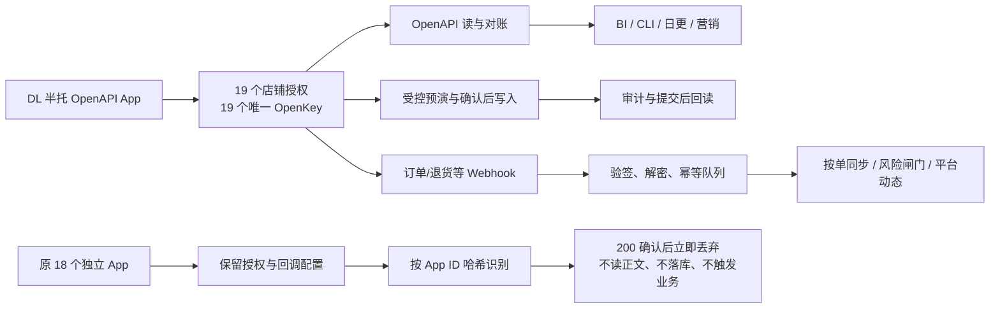

# 半托 OpenAPI 单应用生产切换（2026-07-26）

> 历史记录：该拓扑已于2026-07-30被[19店独立应用切回](openapi-per-store-production-cutback-2026-07-30.md)取代。本文仅用于解释当时迁移与回滚资产，不再代表当前生产状态。

## 结论

2026-07-26 已把本项目 19 个半托店铺的生产 OpenAPI 数据面统一到 **DL 半托应用**：

- 生产私有配置只有 `1` 个 App、`19` 个店铺授权和 `19` 组唯一店铺 OpenKey。
- OpenAPI 读、受控写、BI Portal、负责人/合作方 CLI、日更对账、营销库存兜底和 Webhook worker 均读取同一份生产私有配置。
- 全托项目不在本次范围内；`shein-fm-*` 不复用本次授权、数据库触发器或 Webhook 订阅。
- 原 18 个独立 App 和店铺授权未删除，作为回滚资产保留，但不再进入经营数据处理或 SHEIN 写流程。

## 当前数据面

## 覆盖的生产环节

| 环节 | 切换结果 |
|---|---|
| OpenAPI 通用只读 | 19 店均改用 DL App 下各自的新店铺凭据 |
| 销售、退货、财务、商品对账 | 按次读取统一生产配置；无旧 App 固定映射 |
| 商品发布、上下架、标题、图片、库存、供货价、商品售价、资质 | 预演、哈希确认、真实提交和回读均使用统一生产配置 |
| BI Portal / 网页运营助手 | Portal 已重启并回读 19 店均可读、可预演、可确认提交 |
| 负责人及合作方 CLI | 继续只连接云端 BI；`doctor` 与 `capabilities` 已回读 19/19 |
| 营销任务 | 营销活动页面流程保持原排班；需要 OpenAPI 库存/身份查询的步骤读取统一配置 |
| Webhook | DL App 正式/测试 443 回调均已开通；13 个半托事件开启，视频转换保持关闭 |
| Webhook 订单/退货实时入仓 | 继续按店铺 OpenKey 路由，不改数据库实时销售切源 |
| 日更、最终日收口、watchdog | 保持现有合理排班；不恢复已删除的每小时当天全店轮询 |
| 回滚 | 旧密钥、旧代码、服务状态和切换前配置均有只读备份 |

## Webhook 特殊处理

### 共享 App 的店铺路由

真实经营事件必须携带已授权店铺的 `x-lt-openKeyId`。接收器先用 DL App 验签，再把 OpenKey 严格映射到唯一店铺；已知跨店不一致、未知 App、重复店铺或缺凭据仍失败关闭。

开放平台的“消息测试”和订阅验证使用 App 级临时 OpenKey。共享 App 无法从这种临时值判断店铺，因此私有配置显式指定 `webhookValidationStoreKey=DL`，并把该类回调标记为 `appScopedOnly`：

- 只用于签名、入口、数据库队列和 worker 的技术验收；
- 固定为 P3；
- 不查订单/退货详情；
- 不修改任务、经营事实或店铺闸门；
- 不发送飞书。

### 原独立 App 退出生产

DX 旧 App 的 13 个事件订阅已在平台侧关闭。其余旧开放平台账号的开发者登录态已过期，且本机没有可自动使用的开发者凭据；为了不要求逐账号重新登录，同时保证切换立即闭环，生产接收器采用更严格的数据面退出方案：

- 活跃配置不再保存原 18 个 App 的 App Secret 或店铺密钥；
- 只保存原 App ID 的 SHA-256 哈希；
- 命中旧 App 时在读取请求正文、验签解密、写 receipt 和调用业务 handler **之前**直接返回 200 并丢弃；
- 因此旧 App 即使仍由平台推送，也不会产生重复订单、重复退货、告警、闸门或任何 SHEIN 写操作。

这 17 个平台订阅属于“平台后台残留”，不是生产依赖。以后若逐账号登录，可继续关闭订阅；是否关闭不影响当前数据面正确性。

## 验收证据

- 隔离迁移探测：`19/19` 店成功。
- 切换后直接针对正式配置再次探测：`19/19`，`pending=0`，`failed=0`。
- 正式配置结构：`apps=1`、`stores=19`、`uniqueOpenKeys=19`、无全局旧 App fallback、权限 `0600`。
- Webhook 启动回读：`appCount=1`、`storeCount=19`、`retiredAppCount=18`，数据库正常、worker 已启用。
- DL App 平台实时回读：正式/测试回调均为标准 443 且“已开通”；14 个可见事件中 13 个已订阅，视频转换未订阅。
- 官方安全消息测试：入口返回 200，命中既有 `subscription_validation` 幂等 receipt；保持 `appScopedOnly + P3`，无飞书、无业务键、无闸门变化。
- 切换后的真实 DL 退货事件已按单处理为 `return_warehouse_synced`。
- Webhook 队列：开放队列 `0`、dead-letter `0`、被关闭店铺闸门 `0`。
- CLI `doctor`：19 店 `authorized/apiConnected/readReady/writePrecheckReady/writeConfirmable/controlledSubmitReady` 全部为 19。
- 19 店 `update_inventory` 受控写检查：全部可 dry-run，全部在预演与明确确认后可真实提交；本次验收未执行商品或库存写入。
- 本地确定性回归：`112/112` 通过；共享 App 技术探针、退役 App 提前丢弃和营销测试数据隔离均有专项回归。
- Portal 与 Webhook 服务均为 `active`；Portal 实时 LISTEN/SSE 为 `connected=true`。
- 所有本轮本机店铺浏览器均已关闭，CDP 端口无残留。

## 备份与回滚

关键备份：

- 原 19 App 私有配置：`/srv/shein-bi/secrets/openapi-legacy/shein_openapi.pre-consolidation-20260726-135510.json`
- 单 App 原子切换备份：`/srv/shein-bi/backups/openapi-consolidation-dl-20260726-151811`
- Webhook 旧 App 隔离备份：`/srv/shein-bi/backups/openapi-consolidation-webhook-retirement-20260726-153528`
- 本机旧私有配置：`%USERPROFILE%\.shein-bi\backups\shein_openapi.pre-consolidation-20260726.json`

回滚步骤：

1. 暂停 `shein-bi-portal.service` 与 `shein-bi-webhook.service`，避免切换中出现混合凭据。
2. 从上述备份恢复 `config/shein_openapi.local.json`、`lib/shein_webhook_config.mjs` 和 `scripts/serve_shein_webhook.mjs`。
3. 校验文件属主、私有配置权限 `0600`，再启动 Webhook 和 Portal。
4. 运行 19 店只读探测、Webhook health、CLI doctor 和队列/闸门检查。
5. 若确实回滚到旧 DX App 数据面，还需重新开启 DX 的 13 个平台事件订阅；其他旧 App 的授权和订阅未删除。

回滚不删除 OpenAPI 事实表、Webhook receipt、审计记录或 DL 新授权，避免丢失证据并允许再次切换。
