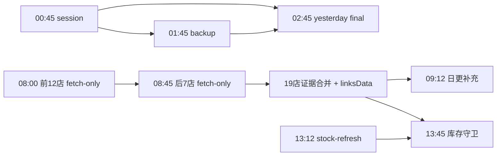

# 半托 / 全托共用主机排班与资源合同

> 生效基线：2026-08-04。生产事实仍以两项目各自 `infra/systemd/*.timer`、云端 `systemctl list-timers` 和共享锁回读为准。

## 1. 不可破坏的主机合同

- 共用服务器只有一条重任务车道：`/run/lock/shein-host-heavy.lock`。
- 锁顺序固定为 `host -> project -> domain -> pressure -> command`，禁止反向加锁。
- 主机总重任务 slice 为 `shein-host-heavy.slice`；半托只安装/维护子 slice `shein-host-heavy-bi.slice`，不得覆盖全托维护的主机 slice 或 tmpfiles 合同。
- 全托每小时 `:32–:43` 永久保留给核心首页 WebAPI/Chrome。半托重任务必须在 `:27` 前释放；低优先级任务更早在 `:17` 释放，为 `:20` ET 留出车道。
- 半托订单 Webhook、单订单 OpenAPI upsert、`liveSalesToday`、15 分钟当天销售 reconciliation 和 `:12` 库存主轮属于轻量快车道，不拿 host-heavy 锁。
- 所有 timer 均为 `Persistent=false`。缺跑依靠带日期的 done marker、watchdog 和明确的安全补跑槽处理，不允许服务器重启后在任意分钟堆叠重任务。

## 2. 联合日时间轴

| 时间 | 项目 | 任务 | 截止 / 依赖 |
| --- | --- | --- | --- |
| 每小时 `:05` | 全托 | 当天销售 OpenAPI | 轻量快车道 |
| 每小时 `:12` | 半托 | 19 店当前库存主轮 | 轻量快车道；`07:12` 同轮有界补齐商品详情，其余轮复用详情缓存；每轮成功写 `stock-refresh` marker |
| 每小时 `:32–:43` | 全托 | 核心首页 WebAPI/Chrome | 永久保留，11 分钟硬超时 |
| 每小时 `:45` | 半托 | 库存机会轮 | 轻量；锁外运行，不阻塞重车道 |
| 每 15 分钟 | 半托 | 当天销售 OpenAPI reconciliation | 轻量灾备/纠偏；Webhook 仍是首要实时来源 |
| `00:10` | 半托 | 磁盘维护 | 00:27 前释放 |
| `00:45` | 半托 | 19 店 session 维护 | 完成写 `nightly-session`；01:27 前释放 |
| `01:12 / 04:12` | 半托 | 夜间 ET | 避开下一小时首页车道 |
| `01:45` | 半托 | PostgreSQL 备份 | 依赖 `nightly-session`；01:52 前释放 |
| `01:55` | 全托 | 数据库备份 | 02:27 前释放 |
| `02:10` | 全托 | session renewal | 02:27 前释放 |
| `02:45` | 半托 | 昨日最终销售 + 稳定日复核 | 依赖 session + backup markers；03:27 前释放 |
| `03:45` | 全托 | supply | 04:27 前释放 |
| `04:45` | 全托 | finance | 完成后释放共享锁 |
| `04:50` | 半托 | RTV 追踪复核 | 05:27 前释放；失败延期，不占 05:32 首页 |
| `05:45 / 06:45 / 07:45 / 09:45 / 10:45` | 全托 | 五店日更批次 | 每批显式 batch，禁止按小时隐式推导 |
| `06:52` | 半托 | 订单生命周期闭环 | 07:27 前释放；成功后才刷新订单 section |
| `08:00–08:27` | 半托 | 链接/业务域前 12 店 | 仅抓取，写 `morning-chunk-1`，不提前合并；重跑复用当天已完成店铺 |
| `08:45–09:10` | 半托 | 剩余 7 店 + 19 店合并 | 依赖 chunk 1；同步发布 `linksData`，写 `morning-links-ready` |
| `09:12–09:27` | 半托 | OpenAPI/成本/利润补充阶段 | 必须等 `morning-links-ready`；商品详情轮转由 `07:12` 库存任务负责；不再内嵌 RTV |
| `13:45–14:17` | 半托 | 库存自动守卫 | 依赖 `morning-links-ready` 与当天 `13:12` 后的 `stock-refresh`；位于 `13:32–13:43` 首页后，最晚在 `14:20` ET 仓储费前释放 |
| `11:50` | 全托 | 日更缺口补采 | 关键任务优先 |
| `12:45` | 全托 | COS 归档 | 非上班前业务数据；给完整受控窗口，避免 partial 大文件 |
| `14:20–14:27` | 半托 | ET 仓储费 | 只读账单、利润 cache 和对账 |

其它半托 ET 检查点保留 `07/10/13/17/20/23:20`；营销只读 guard 为 `11:00/13:00/16:00`，不再占 `:30`；repair 在 host 锁忙、压力高或截止到达时记为 `deferred_to_local`，不和主机关键任务抢跑。

## 3. 晨间依赖 DAG

所有依赖使用 `state/pipeline-markers/YYYY-MM-DD/*.json` 校验；`After=` 和钟点只负责排序，不可代替业务完成证据。

## 4. Portal 单队列

- 浏览器页面、SSE、core warmup 不再直接后台扇出 16 个 section，也不允许普通请求现场启动 `orders`、`profit` 或成本台账重算。
- `liveSalesToday`、`productState`、`inventoryStock` 仍可在 Portal 轻量快车道同步生成。
- 其它 section 统一进入 `state/portal-section-queue/queue.json`；`shein-bi-cloud-portal-section-queue.service` 持共享 host 锁后逐个同步生成。
- 队列 worker 只允许由正式 service 在每小时 `:43–:59` 安全起跑窗口进入；直接从 SSH/脚本在 `:00–:42` 拉起必须返回 75 并保留 pending 队列，禁止用“下一小时 :17 截止”把一次手工任务放大成近一小时锁占用。
- 只有无代理头的本机请求并带 `X-SHEIN-BI-HOST-LOCKED-WORKER: 1` 才能绕过排队。公网或普通 BI 用户不能伪装成重任务 worker。
- 订单事件先发布 `liveSalesToday`；退货和历史订单变动只把成本/利润重算入队，不得让销售实时展示等待移动加权成本。
- worker 被截止信号终止时，队列 lease 会自动过期并在下一安全窗口恢复；旧 section JSON 原子保留。

## 5. 营销与浏览器

- 营销 guard 是 browserless/session HTTP，只读扫描；repair 才可能使用受控浏览器写入。
- repair 先拿 host 锁，再拿半托项目锁和营销域锁；主机忙时保留精确队列并转本地浏览器续跑。
- 孤儿 Chrome 清理改为 `03:20/09:25/21:20`，同样受 host 锁和有效浏览器租约保护；不得在全托 supply 或核心 home 车道清理。
- 每个业务脚本只关闭自己租约创建的浏览器。全托 profile 和半托 profile 路径隔离，半托清理器不得扫描或终止全托 Chrome。

## 6. 验收

部署后至少回读：

1. 半托 timer 的 `OnCalendar` 与 `Persistent=false`；
2. 所有半托重 service 均在 `shein-host-heavy-bi.slice`，且 `SuccessExitStatus=75`；
3. Webhook、15 分钟 sales reconcile、`:12` stock 不含 host-heavy 锁；
4. 普通 Portal 重 section 请求返回排队/旧原子 cache，worker 请求才实际生成；
5. host 锁被全托持有时，半托重任务返回 75，不启动 Chrome；
6. 浏览器租约存在时 cleanup 不杀进程，结束后 orphan cleanup 可回收；
7. `systemd-analyze verify`、确定性测试、Portal health、共享锁互抢和云端源码一致性检查全部通过。
