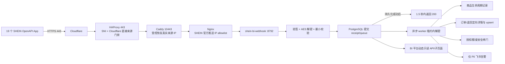

# SHEIN Webhook 接收与“平台动态”运行说明

> 状态：2026-07-20 已完成代码、数据库迁移、BI 子页面、P0 飞书出口、云端服务，以及 19/19 App 正式/测试回调和每店 10/10 事件订阅验收。

## 1. 业务目标

Webhook 是平台状态变化的实时触发源，不替代 OpenAPI 详情接口，也不直接触发任何 SHEIN 写操作。

- 商品接收、审核、上下架和删除审核：进入“平台动态”。公网接收进程不读取可变运营任务表；任务自动挂接留给后续独立授权的 reconciler。
- 订单、退货：收到单号后调用详情接口，只增量 upsert 这一单，再按店铺+单号回读。
- 授权、商品额度、合规：产生高优先级风险；授权异常和额度为 0 会关闭对应店铺的真实写闸门。
- 飞书只发 P0；正常订单、正常退货和普通状态变化只在 BI 查看。
- 飞书问数/QA bot 不参与此链路，也无需恢复。

## 2. 生产架构



固定回调：

```text
POST https://sa.dushengyi.cc/api/shein/webhook/v1/events
```

回调 URL 不带 query。19 个 App 可以配置同一 URL；正式业务事件依据 `x-lt-appid + x-lt-openKeyId` 映射到唯一店铺，已知跨店不一致、映射不唯一、缺店或重复店铺时失败关闭，不猜店铺。只有开放平台自身的技术探针可在 App 唯一映射时进入下述 `appScopedOnly` 隔离路径。

正式链路复用标准 443，但没有让应用直接信任客户端自报的 `CF-Connecting-IP`：HAProxy 先确认 `sa.dushengyi.cc` SNI 的直接来源属于 Cloudflare，再把 TLS 流量转到 Caddy `10443`；Caddy 只在这条受控上游后恢复 Cloudflare 写入的原始客户端 IP，Nginx 最后按 SHEIN 官方推送 IP 放行。签名仍是主校验，来源 IP 只是独立第二层。`8443` 继续作为受限故障回退，但不得写入平台正式/测试回调。

## 3. 官方协议实现

请求头：

- `x-lt-openKeyId`
- `x-lt-eventCode`
- `x-lt-appid`
- `x-lt-timestamp`
- `x-lt-signature`

开放平台实际推送的 `x-lt-eventCode` 可能是订阅路由名（例如 `product_document_receive_status_notice`），并不总是文档目录中的数字编号。接收器将 10 个允许路由名映射到内部固定数字事件定义，同时保留数字编号兼容；未知路由仍失败关闭。

请求体主要为 `multipart/form-data` 的 `eventData` 字段；考虑官方文档表述差异，接收器还兼容 JSON 和 urlencoded，但同样执行严格大小、重复字段和格式校验。

签名：

```text
apiKey = x-lt-appid（缺失时回退 x-lt-openKeyId）
randomKey = x-lt-signature 前 5 字符
signString = apiKey + "&" + timestamp + "&" + callbackPath
secret = appSecretKey + randomKey
hashHex = lowercase_hex(HMAC-SHA256(signString, secret))
expected = randomKey + Base64(UTF8(hashHex))
```

签名使用常量时间比较，并校验 5 分钟时间窗。解密采用 AES-128-CBC/PKCS5Padding：key 为 `appSecretKey` UTF-8 前 16 字节（不足补零），IV 为 `space-station-default-iv` 前 16 字节。

接收器只有在 receipt 与队列状态已在同一数据库事务中持久化后才返回 200。应用入口总预算为 1.2 秒，receipt 事务 statement timeout 为 0.8 秒，Nginx read timeout 为 1.4 秒；不能可靠落库时在平台 1.5 秒超时前返回 503，让 SHEIN 重推。平台重推命中 `idempotency_key` 时只增加重复计数，不重复通知。

## 4. 第一阶段事件

| 批次 | eventCode | 事件 | 处理 |
|---|---:|---|---|
| 商品生命周期 | 3000910 | 商品接收 | 平台动态；保留强身份供后续 reconciler 使用 |
| 商品生命周期 | 3001450 | 商品审核 | 失败为 P0；不让公网进程改运营任务 |
| 商品生命周期 | 3001449 | 全渠道商品审核 | 和普通审核统一归一并幂等 |
| 商品生命周期 | 3000848 | 商品上下架 | 非预期下架为 P0 |
| 商品生命周期 | 3001903 | 商品删除审核 | 删除获批或审核失败均为 P0 |
| 订单/退货 | 3001442 | 订单同步 | 按订单号详情、targeted upsert、回读 |
| 订单/退货 | 3000914 | 退货单同步 | 按退货单号详情、targeted upsert、回读 |
| 风险 | 3001503 | 授权关系变更 | P0；关闭该店授权闸门 |
| 风险 | 3001061 | 商品额度变更 | 额度 0 为 P0/关闭闸门；恢复为正数自动开闸 |
| 风险 | 3001104 | 合规信息失效 | 必需合规为 P0；按业务对象处理，不错误地封整店 |

官方目录当前为 23 个 Webhook（新增 `3001903`）。其余事件已能安全解析和入库，但第一阶段不主动订阅；价格异常、库存预警等 P1 也不发飞书。

## 5. 数据与并发

迁移：`infra/warehouse/migrations/20260719_001_shein_webhook_runtime.sql`

- `ops.shein_webhook_receipt`：AES 密文 `event_data`、密文 hash、最小规范化投影、幂等键、状态、lease、重试、告警与处理结果；不保存解密后的原始 payload。
- `ops.shein_webhook_store_gate`：店铺级授权/额度闸门，同时保存平台事件顺序值；额度乱序按平台 `sendTimeStamp` 而不是本地收件 ID 判新旧。
- worker 使用 `FOR UPDATE SKIP LOCKED` 领取任务；过期 lease 可恢复。
- worker 只在持有 lease 时按当前 App secret 解密；lease 续约失败会中止后续处理。
- 最多重试 8 次，指数退避后进入 `dead_letter`。
- BI API 永不返回 app id、openKey、密文、原始 payload 或凭据。

订单/退货 targeted 模式与原来的日期全量 loader 完全隔离：详情没有至少一条 item 时拒绝写入；每条事实都携带 `source_snapshot_at`。通过后在同一事务调用数据库按单 `SECURITY DEFINER` apply 函数；函数验证全部行都属于同一店铺/单号、主子键不跨作用域，并按抓取版本比较现有 header。只有当前快照不旧于库内版本时，才原子替换该单 header/子项/付款标记。它不执行日期切片删除、不改写整日 reconciliation，最后回读 source snapshot 与行数；若已被更新快照取代，明确记为 `superseded` 而不是重写新事实。

targeted 与日期 loader 对同一店铺使用同一 PostgreSQL advisory lock；两者都在首次 API 请求前记录版本，日期 loader 的清理、header conflict update 和 child insert 还会再次比较 `source_snapshot_at`。因此锁负责串行，版本负责判新旧：即使日期 loader 先开始抓旧快照、在较新 Webhook 写入后才完成，旧 header、item 和 payment flag 也会被整体拒绝。

worker 直接使用独立受限 PostgreSQL 角色 `shein_webhook_ops`，不调用 `sudo`/Docker。它只获得 webhook receipt/gate 运行权限、五张事实表只读回读和两个按单 apply 函数的执行权；没有事实表原始 `INSERT/UPDATE/DELETE`、日汇总或 reconciliation 写权限，也没有 `ops.link_ops_*` 权限。Portal 继续使用 `shein_link_ops`：数据库只允许它读取 receipt/gate 安全投影，并通过受控函数解除“同一来源 receipt”的授权闸门；不能读取 `event_data/app_id/open_key_id/cipher_hash`、任意改 gate 或修改订单/退货事实。

## 6. 写安全边界

- Webhook 永不直接调用 SHEIN 写接口。
- 商品事件保留“店铺 + 平台强身份字段”，但公网 receiver 不连接 `ops.link_ops_*`；任务 readback 必须由后续独立最小权限 reconciler 完成。
- 授权闸门可由事件之后更新、更成功的店铺只读探针自动解除。
- 商品额度必须收到正数恢复事件才开闸。
- 授权无业务时间的重复真实事件以签名时间区分，重签重试按“店铺+状态+10 分钟时间桶”抑制重复飞书，但 receipt 与封闸仍全部执行；授权/额度先封闸后通知。额度 gate 以平台 `sendTimeStamp` 单调更新，延迟到达的旧恢复事件不能覆盖新归零；无法验证顺序的归零仍立即封闸，且不会被不确定事件自动开闸。
- 真实提交在预检查、整批 executor 前、每个店铺子执行器获得 `execute=true` 前，以及子执行器每一次业务写 `client.request` 的紧前一刻复核 gate；维护任务的多个 payload 逐个复核，前一写后新封闸会阻止下一写。仓库缺失、目标店缺失、查询失败或期间新封闸均失败关闭。
- 合规失效通常是商品/证书级，禁止用店铺级闸门误伤其他商品。
- 原有 dry-run、payload hash、账号权限、明确确认、审计和写后回读全部保留。

## 7. BI 与飞书

BI：导航新增独立“平台动态”页，提供 24 小时事件、待处理、失败、P0 摘要，以及店铺/级别/类型/状态筛选。接口沿用 `bi_session` 和账号 `readStores` 权限；SQL 层再次限制店铺范围。

飞书：复用 `lark-cli im +messages-send` 的现有通知身份，但仅发送 P0；普通事件按 receipt 幂等，官方无事件 ID 的授权重签按 10 分钟时间桶去重，不恢复已暂停的问数服务。详情与普通事件留在 BI，避免刷屏。

开放平台在保存订阅或执行“消息测试”时，可能发送 App 签名有效但 openKey 不属于任何正式店铺的技术样例。只有 App 本身能唯一映射到一个店铺时才接收这类投递，并标记 `appScopedOnly + deliveryScope=app_only + P3`。该标记必须从 ingress 持久化到 worker：技术样例只保留审计 receipt，不运行商品/订单/退货 handler、不产生 gate、不修改运营任务、不发飞书。正常 BI summary/timeline 默认过滤它们；只有显式 `includeTechnical=true` 的审计调用可读取。

## 8. 部署与验收

1. 先备份生产应用、当前生效的 Nginx 站点（现网为 `/etc/nginx/sites-available/shein-bi`）、`/etc/caddy/Caddyfile`、现有 unit 和相关数据库 ACL 快照；生产应用工作树有运行态改动时只上传本版本精确文件，禁止 `git pull/reset/clean`。
2. 以 root 运行 `scripts/provision_shein_webhook_postgres_role.sh` 创建/收紧 `shein_webhook_ops`（LOGIN、NOSUPERUSER、NOCREATEDB、NOCREATEROLE、NOINHERIT、NOREPLICATION）；随机密码仅写 `/srv/shein-bi/secrets/webhook-warehouse.env` 的 `SHEIN_WAREHOUSE_PG_PASSWORD`，文件 `root:root 0600`，不得复用 `portal-warehouse.env` 或 `shein_link_ops` 密码。随后以数据库 owner 执行 `infra/warehouse/migrations/20260719_001_shein_webhook_runtime.sql`。
3. 权限验收必须同时证明：`shein_webhook_ops` 可写 receipt/gate、只读回读五张事实表并调用两个 scoped/versioned apply 函数，但事实表原始 INSERT/UPDATE/DELETE、底层 prepare 函数与 `ops.link_ops_*` 查询被拒绝；`shein_link_ops` 只能 SELECT receipt/gate 安全列并调用授权恢复函数，读取 `event_data`、任意 UPDATE gate 与修改订单/退货事实均被 PostgreSQL 拒绝。
4. 安装 `infra/systemd/shein-bi-webhook.service` 与 Nginx 配置。标准 443 回调要同时核对 `infra/haproxy/haproxy-ssh-https.cfg` 和 `infra/caddy/Caddyfile.shein-bi`：HAProxy 必须保留 SSH-over-443 并只允许 Cloudflare 直接来源进入目标 SNI 的 HTTPS backend；禁止用仓库配置子集覆盖生产其他域名或 SSH 分流。
5. 依次执行 `haproxy -c`、`caddy validate`、`nginx -t`、`systemd-analyze verify` 后才 reload/start；从 Cloudflare、HAProxy、Caddy、Nginx 到 receiver 逐跳验证真实来源 IP 和拒绝路径。受限 `8443` 回退继续沿用 Cloudflare 网段防火墙规则，不对全网开放。
6. 验证 `http://127.0.0.1:8792/healthz`、数据库队列、BI 页面与来源 IP 拒绝路径；确认 `shein-bi-lark-sales-qa.service` 仍为 `disabled + inactive`。

开放平台侧要在每个 App 中配置 `https://sa.dushengyi.cc/api/shein/webhook/v1/events`，正式/测试回调都回读到审核通过，再逐项订阅上述 10 个事件。平台订阅/调试样例的验收标准是回调 2xx、receipt 唯一、worker 成功且保持 `appScopedOnly + P3`，不得以技术样例验证真实业务 handler。订单定向入仓、授权/额度闸门和 P0 飞书仍要用受控的业务级测试或真实事件单独验收。

2026-07-20 生产回读：19/19 App 的正式/测试回调均审核通过，事件订阅均为 10/10；CX 官方消息测试成功。全店 190 条订阅验证 receipt 全部 `succeeded + P3 + appScopedOnly`，业务 gate、合成订单/退货行、飞书告警均为 0。上线过程中曾发现 worker 重建规范化对象时丢失隔离标记，造成测试样例短暂副作用；修复后已精确回滚 28 个 gate、14 个退货 header/14 个 item，撤回实际发送的 74 条飞书测试消息，并保留 190 条 receipt 作为审计证据。

官方文档提供了事件 payload 样例，但没有发布可独立核对的签名/密文 golden vector；本地密码学测试因此是协议公式与 round-trip 门禁，不能冒充官方向量。上线验收还必须用真实 App secret 发送一次不打印明文/密钥的有效合成请求，并清理测试 receipt，再用平台官方调试推送完成最终证明。

## 9. 回滚顺序

1. `systemctl disable --now shein-bi-webhook.service`，先停止接收与 worker；不要删除既有 receipt，它们是审计证据。
2. 恢复本次部署前备份的 `/etc/haproxy/haproxy.cfg`、`/etc/caddy/Caddyfile` 与 `/etc/nginx/sites-available/shein-bi`；分别执行 `haproxy -c`、`caddy validate`、`nginx -t` 后 reload，确认 SSH-over-443 未受影响。
3. 若同时回滚受限 `8443` 故障入口，再按部署记录逐条删除对应 Cloudflare 防火墙规则并确认不再监听/放行；不要把 8443 误当正式平台回调继续保留。
4. 恢复备份的 Portal unit 与精确应用文件，`systemctl daemon-reload` 后重启 Portal；再次确认飞书问数仍为 `disabled + inactive`。
5. `ALTER ROLE shein_webhook_ops NOLOGIN` 并撤销它对 webhook/fact 表与受控函数的权限；专用 secret 文件先归档到仅 root 可读备份，确认无需重放后再销毁。若上线前 ACL 快照显示 migration 之外还发生过权限变化，按快照逐项恢复，禁止猜测式 `GRANT ALL`。
6. 数据表默认保留。只有 receipt/gate 已为空、审计已导出且负责人明确批准，才允许单独迁移删除；不得为了“回滚干净”直接 DROP 生产证据。
7. 验证 BI 原页面、受控写 dry-run、Nginx/Caddy 配置和现有 timers；记录备份目录、恢复文件 hash 与回滚时间。

## 10. 安全要求

- `appSecretKey`、店铺 secretKey、解密后的 `eventData` 和买家信息不得进入 Git、前端、数据库原始字段或普通日志。
- 私有凭据继续只放 `config/shein_openapi.local.json`/云端 secrets。
- Cloudflare/UFW/Caddy 来源链与 Nginx SHEIN 官方推送 IP allowlist 是第二层；签名始终是主校验。
- Cloudflare 或 SHEIN 官方 IP 变更时须同步更新 allowlist，并通过“最后收到时间”监控发现静默断流。
