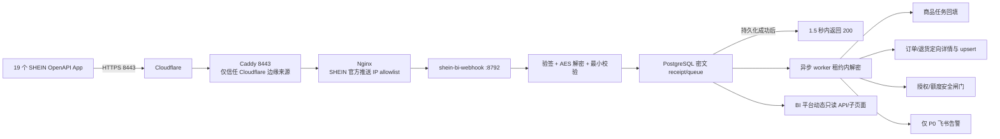

# SHEIN Webhook 接收与“平台动态”运行说明

> 状态：2026-07-19 已完成代码、数据库迁移、BI 子页面、P0 飞书出口和云端服务定义。真实回调是否生效，以开放平台各 App 的订阅与线上回调验收为准。

## 1. 业务目标

Webhook 是平台状态变化的实时触发源，不替代 OpenAPI 详情接口，也不直接触发任何 SHEIN 写操作。

- 商品接收、审核、上下架和删除审核：进入“平台动态”，并在身份唯一时回填现有运营任务。
- 订单、退货：收到单号后调用详情接口，只增量 upsert 这一单，再按店铺+单号回读。
- 授权、商品额度、合规：产生高优先级风险；授权异常和额度为 0 会关闭对应店铺的真实写闸门。
- 飞书只发 P0；正常订单、正常退货和普通状态变化只在 BI 查看。
- 飞书问数/QA bot 不参与此链路，也无需恢复。

## 2. 生产架构



固定回调：

```text
POST https://sa.dushengyi.cc:8443/api/shein/webhook/v1/events
```

回调 URL 不带 query。19 个 App 可以配置同一 URL；服务依据 `x-lt-appid + x-lt-openKeyId` 映射到唯一店铺。映射不唯一、缺店、重复店铺或 App/openKey 不一致时启动/请求失败，不猜店铺。

`8443` 是 Cloudflare 支持的 HTTPS 代理端口。生产链路没有让应用直接信任客户端自报的 `CF-Connecting-IP`：UFW 只允许 Cloudflare 官方网段访问 8443，Caddy 再校验直接对端属于同一网段，随后才把 Cloudflare 覆盖写入的原始客户端 IP 传给 Nginx；Nginx 最后按 SHEIN 官方推送 IP 放行。签名仍是主校验，来源 IP 只是独立第二层。

## 3. 官方协议实现

请求头：

- `x-lt-openKeyId`
- `x-lt-eventCode`
- `x-lt-appid`
- `x-lt-timestamp`
- `x-lt-signature`

请求体主要为 `multipart/form-data` 的 `eventData` 字段；考虑官方文档表述差异，接收器还兼容 JSON 和 urlencoded，但同样执行严格大小、重复字段和格式校验。

签名：

```text
apiKey = x-lt-appid（缺失时回退 x-lt-openKeyId）
randomKey = x-lt-signature 前 5 字符
signString = apiKey + "&" + timestamp + "&" + callbackPath
secret = appSecretKey + randomKey
hashHex = lowercase_hex(HMAC-SHA256(signString, secret))
expected = randomKey + Base64(UTF8(hashHex))
```

签名使用常量时间比较，并校验 5 分钟时间窗。解密采用 AES-128-CBC/PKCS5Padding：key 为 `appSecretKey` UTF-8 前 16 字节（不足补零），IV 为 `space-station-default-iv` 前 16 字节。

接收器只有在 receipt 与队列状态已在同一数据库事务中持久化后才返回 200。应用入口总预算为 1.2 秒，receipt 事务 statement timeout 为 0.8 秒，Nginx read timeout 为 1.4 秒；不能可靠落库时在平台 1.5 秒超时前返回 503，让 SHEIN 重推。平台重推命中 `idempotency_key` 时只增加重复计数，不重复通知。

## 4. 第一阶段事件

| 批次 | eventCode | 事件 | 处理 |
|---|---:|---|---|
| 商品生命周期 | 3000910 | 商品接收 | 平台动态；唯一强身份时回填任务 |
| 商品生命周期 | 3001450 | 商品审核 | 失败为 P0；任务回填 |
| 商品生命周期 | 3001449 | 全渠道商品审核 | 和普通审核统一归一并幂等 |
| 商品生命周期 | 3000848 | 商品上下架 | 非预期下架为 P0 |
| 商品生命周期 | 3001903 | 商品删除审核 | 删除获批或审核失败均为 P0 |
| 订单/退货 | 3001442 | 订单同步 | 按订单号详情、targeted upsert、回读 |
| 订单/退货 | 3000914 | 退货单同步 | 按退货单号详情、targeted upsert、回读 |
| 风险 | 3001503 | 授权关系变更 | P0；关闭该店授权闸门 |
| 风险 | 3001061 | 商品额度变更 | 额度 0 为 P0/关闭闸门；恢复为正数自动开闸 |
| 风险 | 3001104 | 合规信息失效 | 必需合规为 P0；按业务对象处理，不错误地封整店 |

官方目录当前为 23 个 Webhook（新增 `3001903`）。其余事件已能安全解析和入库，但第一阶段不主动订阅；价格异常、库存预警等 P1 也不发飞书。

## 5. 数据与并发

迁移：`infra/warehouse/migrations/20260719_001_shein_webhook_runtime.sql`

- `ops.shein_webhook_receipt`：AES 密文 `event_data`、密文 hash、最小规范化投影、幂等键、状态、lease、重试、告警与处理结果；不保存解密后的原始 payload。
- `ops.shein_webhook_store_gate`：店铺级授权/额度闸门。
- worker 使用 `FOR UPDATE SKIP LOCKED` 领取任务；过期 lease 可恢复。
- worker 只在持有 lease 时按当前 App secret 解密；lease 续约失败会中止后续处理。
- 最多重试 8 次，指数退避后进入 `dead_letter`。
- BI API 永不返回 app id、openKey、密文、原始 payload 或凭据。

订单/退货 targeted 模式与原来的日期全量 loader 完全隔离：同一事务只按 `店铺 + 订单号/退货单号` 精确删除该单既有子项（订单 item/payment flag 或退货 item），再 upsert 当前 header/子项；不执行日期切片删除、不改写整日 reconciliation，最后按同一业务键核对 header/子项数量。

worker 直接使用独立受限 PostgreSQL 角色 `shein_webhook_ops` 执行这些 SQL，不调用 `sudo`/Docker。它只获得 webhook receipt/gate 与上述精准订单/退货表所需权限，不拥有日汇总或 reconciliation 写权限。Portal 继续使用 `shein_link_ops`：数据库只允许它读取 receipt 的安全投影列并维护 gate，不能读取 `event_data/app_id/open_key_id/cipher_hash`，也不能删除订单/退货事实。

## 6. 写安全边界

- Webhook 永不直接调用 SHEIN 写接口。
- 商品任务只在“店铺 + 至少两个平台强身份字段”全部精确匹配且结果唯一时附加 readback；0 个或多个候选只标记 unmatched/ambiguous。
- 授权闸门可由事件之后更新、更成功的店铺只读探针自动解除。
- 商品额度必须收到正数恢复事件才开闸。
- 授权无业务时间的重复真实事件以签名时间区分；额度/授权 gate 按 receipt ID 单调更新，旧事件不能覆盖新事件。
- 真实提交在预检查和 executor 获得 `execute=true` 前各查一次 gate；仓库缺失、查询失败或期间新封闸均失败关闭。
- 合规失效通常是商品/证书级，禁止用店铺级闸门误伤其他商品。
- 原有 dry-run、payload hash、账号权限、明确确认、审计和写后回读全部保留。

## 7. BI 与飞书

BI：导航新增独立“平台动态”页，提供 24 小时事件、待处理、失败、P0 摘要，以及店铺/级别/类型/状态筛选。接口沿用 `bi_session` 和账号 `readStores` 权限；SQL 层再次限制店铺范围。

飞书：复用 `lark-cli im +messages-send` 的现有通知身份，但仅发送 P0，幂等键来自 webhook receipt，不恢复已暂停的问数服务。详情与普通事件留在 BI，避免刷屏。

## 8. 部署与验收

1. 先备份生产应用、当前生效的 Nginx 站点（现网为 `/etc/nginx/sites-available/shein-bi`）、`/etc/caddy/Caddyfile` 和现有 unit；生产应用工作树有运行态改动时只上传本版本精确文件，禁止 `git pull/reset/clean`。
2. 以 root 运行 `scripts/provision_shein_webhook_postgres_role.sh` 创建/收紧 `shein_webhook_ops`（LOGIN、NOSUPERUSER、NOCREATEDB、NOCREATEROLE、NOINHERIT、NOREPLICATION）；随机密码仅写 `/srv/shein-bi/secrets/webhook-warehouse.env` 的 `SHEIN_WAREHOUSE_PG_PASSWORD`，文件 `root:root 0600`，不得复用 `portal-warehouse.env` 或 `shein_link_ops` 密码。随后以数据库 owner 执行 `infra/warehouse/migrations/20260719_001_shein_webhook_runtime.sql`。
3. 权限验收必须同时证明：`shein_webhook_ops` 可写 receipt/精准事实表；`shein_link_ops` 只能 SELECT receipt 安全列并读写 gate，读取 `event_data` 与删除订单/退货事实均被 PostgreSQL 拒绝。
4. 安装 `infra/systemd/shein-bi-webhook.service` 与 Nginx 配置。**只把** `infra/caddy/Caddyfile.shein-bi` 中 8443 callback 站点合并到生产完整 Caddyfile，禁止用仓库子集覆盖生产其他域名。
5. UFW 仅允许 Cloudflare 官方 IPv4/IPv6 网段访问 `8443/tcp`，不对全网开放；依次执行 `caddy validate`、`nginx -t`、`systemd-analyze verify` 后才 reload/start。
6. 验证 `http://127.0.0.1:8792/healthz`、数据库队列、BI 页面与来源 IP 拒绝路径；确认 `shein-bi-lark-sales-qa.service` 仍为 `disabled + inactive`。

开放平台侧要在每个 App 中配置 `https://sa.dushengyi.cc:8443/api/shein/webhook/v1/events`、订阅上述 10 个事件，并用官方调试工具产生真实加密推送。验收标准：回调 2xx、receipt 唯一、worker 成功、BI 可见；再分别验证订单定向入仓、授权闸门和一条受控 P0 飞书消息。开放平台尚未审核/启用订阅时，只能称“接收端已就绪”，不能称“真实回调已上线”。

官方文档提供了事件 payload 样例，但没有发布可独立核对的签名/密文 golden vector；本地密码学测试因此是协议公式与 round-trip 门禁，不能冒充官方向量。上线验收还必须用真实 App secret 发送一次不打印明文/密钥的有效合成请求，并清理测试 receipt，再用平台官方调试推送完成最终证明。

## 9. 回滚顺序

1. `systemctl disable --now shein-bi-webhook.service`，先停止接收与 worker；不要删除既有 receipt，它们是审计证据。
2. 恢复本次部署前备份的 `/etc/nginx/sites-available/shein-bi`，从完整 `/etc/caddy/Caddyfile` 移除/恢复本次 8443 block；分别 `nginx -t`、`caddy validate` 后 reload。
3. 按部署记录逐条删除本次 UFW Cloudflare `8443/tcp` 规则，确认公网 8443 不再监听/放行。
4. 恢复备份的 Portal unit 与精确应用文件，`systemctl daemon-reload` 后重启 Portal；再次确认飞书问数仍为 `disabled + inactive`。
5. `ALTER ROLE shein_webhook_ops NOLOGIN` 并撤销它对 webhook/fact 表的权限；专用 secret 文件先归档到仅 root 可读备份，确认无需重放后再销毁。
6. 数据表默认保留。只有 receipt/gate 已为空、审计已导出且负责人明确批准，才允许单独迁移删除；不得为了“回滚干净”直接 DROP 生产证据。
7. 验证 BI 原页面、受控写 dry-run、Nginx/Caddy 配置和现有 timers；记录备份目录、恢复文件 hash 与回滚时间。

## 10. 安全要求

- `appSecretKey`、店铺 secretKey、解密后的 `eventData` 和买家信息不得进入 Git、前端、数据库原始字段或普通日志。
- 私有凭据继续只放 `config/shein_openapi.local.json`/云端 secrets。
- Cloudflare/UFW/Caddy 来源链与 Nginx SHEIN 官方推送 IP allowlist 是第二层；签名始终是主校验。
- Cloudflare 或 SHEIN 官方 IP 变更时须同步更新 allowlist，并通过“最后收到时间”监控发现静默断流。
