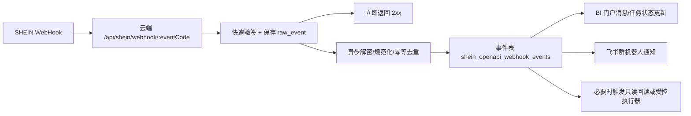

# SHEIN WebHook 接收器设计

> 状态：设计稿。当前 M3 只确定接入模型和后续开发边界，不启用真实 WebHook 回调。

## 1. 目标和边界

SHEIN WebHook 的价值不是替代 OpenAPI 查询接口，而是把平台侧状态变化实时推到我们的云端系统。它最适合作为这些场景的第一触发源：商品审核结果、商品上下架、商品额度变化、订单/退货/采购单状态、库存预警和建议零售价审核/有效期变化。

本项目的 owner 应是云端 BI/API 服务，不应直接把 SHEIN 回调打到飞书机器人或本机 Codex：

- SHEIN 回调要求 1.5 秒内响应，聊天机器人链路不可控。
- 验签、AES 解密、幂等去重和事件落库必须在服务端完成。
- 飞书适合作为通知和人工协同层，不适合作为事件事实源。
- 收到事件后可以再触发 BI 门户提示、飞书群消息、或受控 CLI/执行器任务。

推荐架构：



## 2. 官方回调契约

证据来源：`docs/shein-openapi-doc-center-research-and-plan.md` 与 `docs/shein-openapi-official-capability-inventory.md`。

- 回调方法：`POST`。
- 内容类型：官方描述为 `multipart/form-data`。
- 关键请求头：`x-lt-openKeyId`、`x-lt-eventCode`、`x-lt-appid`、`x-lt-timestamp`、`x-lt-signature`。
- 请求体：`eventData`，为 AES 加密内容。
- 验签使用应用级 `app_id` 与 `app_secretKey`，不是店铺授权得到的 `openKeyId/secretKey`。
- 解密使用 AES/CBC/PKCS5Padding，IV 为 `space-station-default-iv`，密钥为 `app_secretKey`（按现有 `lib/shein_openapi_client.mjs` 授权解密模型，取前 16 字节）。
- SHEIN 以 2xx 响应判断推送成功，因此入口必须先完成最低限度校验和落库，再异步处理。

## 3. 22 个 WebHook 事件清单

| docId | 事件 | path | 建议优先级 | 用途 |
|---:|---|---|---|---|
| 3001450 | 商品审核通知 | `/product_document_audit_status_notice` | P0 | 替代/减少审核状态轮询，驱动商品任务进入待复核/成功/失败。 |
| 3000910 | 商品接收通知 | `/product_document_receive_status_notice` | P0 | 确认平台已接收商品发布/编辑公文。 |
| 3001449 | 商品发布公文审核通知（全渠道） | `/product_document_audit_status_notice_all_channels` | P0 | 覆盖全渠道审核结果，和普通审核通知统一归一。 |
| 3000848 | 商品上下架通知 | `/product_shelves_notice` | P0 | 上下架状态变更实时同步，减少手动回查。 |
| 3001061 | 商品额度变动通知 | `/product_quota_change_notice` | P1 | 和 `shelf-quota` 配合，提示可上架额度不足或恢复。 |
| 3000804 | 商品价格异常通知 | `/product_prices_abnormal_notice` | P1 | 价格异常进入 BI/飞书提醒，避免链接长期异常。 |
| 3000912 | 商品涨价审批结果通知 | `/product_price_audit_status_notice` | P1 | 价格/建议零售价相关审批回读。 |
| 3001792 | 建议零售价审核状态更新 | `/product_rrp_review_status_changed` | P1 | 建议零售价状态变化提醒。 |
| 3001793 | 建议零售价有效期变更 | `/product_rrp_validity_changed` | P1 | 有效期临近/变化提醒。 |
| 3001104 | 商品合规信息失效通知 | `/product_compliance_change_notice` | P1 | 合规失效要进入任务池，避免链接被动下架。 |
| 3001068 | SKU库存预警通知 | `/inventory_warning_notice` | P1 | 库存预警，后续可联动补库存/限时折扣保护。 |
| 3001048 | 推送缺货需求库存数（新） | `/out_of_stock_notice` | P1 | 缺货需求提示。 |
| 3001442 | 订单同步通知 | `/order_push_notice` | P2 | 订单变化事件，可辅助订单/履约增量同步。 |
| 3000914 | 退货单同步通知 | `/return_order_push_notice` | P2 | 退货事件进入售后/利润提醒。 |
| 3001082 | cte开票通知 | `/invoice_status_notice` | P2 | 开票状态提醒。 |
| 3001461 | SHEIN合作物流单下单通知 | `/logistics_order_result_notice` | P2 | 在线下单结果回调。 |
| 3001435 | 采购单通知 | `/purchase_order_notice` | P2 | 采购单状态进入后续采购单模块。 |
| 3001441 | 发货单变更通知 | `/delivery_modify_notice` | P2 | 发货单变化提醒。 |
| 3001744 | 采购退货申请单状态通知 | `/purchase_order_return_application_notice` | P2 | 采购退货申请状态提醒。 |
| 3001765 | 采购单合作物流通知 | `/logistics_forecast_result_notice` | P2 | 采购物流结果提醒。 |
| 3001801 | 采购退货单状态通知 | `/purchase_order_return_notice` | P2 | 采购退货单状态提醒。 |
| 3001503 | 店铺授权关系变更通知 | `/authorization_change_notice` | P0 | openKeyId/secretKey 可能失效或授权被撤销，必须告警并暂停该店写操作。 |

## 4. 服务端处理流程

### 4.1 同步入口

1. 接收 `POST /api/shein/webhook/:eventCode`。
2. 校验请求来源基本形态：方法、`eventCode`、必要 header、`eventData` 存在。
3. 记录 `raw_event`：header、事件路径、收到时间、请求 IP、原始加密体 hash；不要把明文凭证写日志。
4. 验签。失败仍要记录为 `signature_failed`，响应 401/403。
5. 成功后把事件写入队列或数据库 `pending` 状态，并尽快返回 200。

### 4.2 异步处理

1. AES 解密 `eventData`。
2. JSON 解析并规范化成统一结构。
3. 计算幂等键。
4. 如果重复事件，记录 `duplicate`，不重复通知、不重复触发执行器。
5. 根据事件类型执行轻量动作：
   - 商品审核/接收：更新链接任务状态，必要时调用 `audit-status` 或 `search-product` 回读确认。
   - 授权变更：把店铺 OpenAPI 能力标记为需要复核，禁止真实写。
   - 商品额度变化：调用 `shelf-quota` 回读并通知。
   - 库存/价格/合规/订单/退货：先落事件并发通知，不自动写 SHEIN。
6. 通知层只消费已落库事件。

## 5. 幂等、重放和安全

建议幂等键：

```text
sha256(app_id + openKeyId + eventCode + decrypted business id + platform timestamp + eventData hash)
```

如果某类事件没有明确业务单号，则退化为：

```text
sha256(app_id + openKeyId + eventCode + x-lt-timestamp + eventData hash)
```

安全要求：

- `x-lt-timestamp` 必须有时间窗校验，建议 5 分钟；超窗进入 `replay_rejected`。
- 签名比较必须用 constant-time compare。
- `eventData` 原文只保存加密体和 hash；解密明文只保存在受控事件表，不打印到普通日志。
- 不允许 WebHook 直接触发真实写。它只能更新任务状态、发通知、触发只读回读或创建待人工确认任务。
- 授权变更事件优先级最高：一旦授权异常，相关店铺写白名单应暂停，直到人工/探针恢复。

## 6. 建议数据库表

```sql
create table shein_openapi_webhook_events (
  id bigserial primary key,
  received_at timestamptz not null default now(),
  processed_at timestamptz,
  app_id text not null,
  open_key_id text,
  store_key text,
  event_code text not null,
  event_path text not null,
  platform_timestamp text,
  signature_ok boolean not null default false,
  replay_rejected boolean not null default false,
  idempotency_key text not null,
  encrypted_event_hash text not null,
  encrypted_event_data text,
  decrypted_payload jsonb,
  normalized_payload jsonb,
  status text not null default 'pending',
  error text,
  notify_status text,
  source_ip text,
  unique (idempotency_key)
);

create index shein_openapi_webhook_events_event_time_idx
  on shein_openapi_webhook_events (event_code, received_at desc);
```

## 7. 飞书接入方式

最方便的方式是复用现有云端机器人能力，但让飞书只作为事件通知出口：

1. WebHook receiver 落库并规范化事件。
2. 事件分发器生成一段人话摘要，例如“FY 商品 SKC123 审核失败，原因：标题不符合规范，已进入待人工处理”。
3. 调用现有云端飞书机器人发送到指定群。
4. 群消息带 BI 门户任务链接；人工点击进入 BI 处理，而不是在飞书里直接执行 SHEIN 写。

后续如果要允许飞书群内命令处理事件，也应走 BI 任务接口：飞书消息 -> 云端机器人 -> 创建/更新 BI 任务 -> 预检 -> 人工确认 -> 受控执行器。

## 8. 开发里程碑建议

- W1：实现 receiver 骨架、验签/AES 解密单元测试、事件落库、2xx 快速响应。
- W2：接入商品审核/接收/授权变更/额度变动 4 类 P0/P1 事件，触发只读回读。
- W3：接飞书群通知；每类事件先只发摘要和 BI 链接。
- W4：把事件和链接任务状态联动，补 dashboard 最近事件列表。

## 9. 当前不做的事

- 不把 WebHook 直接映射为真实写动作。
- 不把飞书当事件事实源。
- 不在本地 Windows 常驻监听公网回调。
- 不把 `app_secretKey`、`eventData` 明文或店铺 `secretKey` 打进日志。
